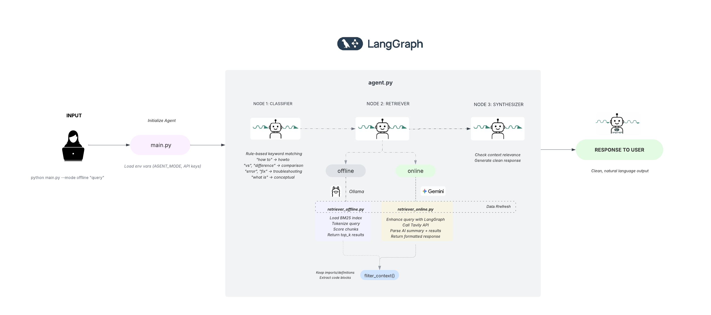

# LangGraph Helper Agent



Hey! This is a helper agent I built to answer questions about LangGraph and LangChain. It's designed to give you quick, code-first answers without all the fluff you'd normally get from an LLM.

## What it does?

The agent works in two modes depending on what you need:

**Offline mode** uses ChromaDB vector search on locally downloaded docs with Ollama (llama3.2). Great when you're on a plane or just want fast, consistent answers without burning through API credits.

**Online mode** taps into Tavily's web search with local Ollama LLM. Use this when you need the latest info or when the docs don't have what you're looking for.

Behind the scenes, it's a clean LangGraph workflow that retrieves relevant context, evaluates it with the LLM, and generates a natural answer. No hallucination, no citing sources you can't verify - just straight code examples and clear explanations.

## Getting started

Install dependencies:

```bash
pip install -r requirements.txt
```

Want to use online mode? Create a `.env` file with your Tavily API key:

```bash
TAVILY_API_KEY=...
```

Tavily is free tier - sign up at [tavily.com](https://tavily.com/) for 1000 searches per month.

Then run with the `--online` flag:

```bash
python main.py --online "What is artificial intelligence?"
```

## Setting up offline mode

If you want to use offline mode, you'll need to download the docs and build a vector store:

```bash
python setup.py
```

This downloads LangGraph/LangChain docs and builds a ChromaDB index. Takes about 30 seconds.

You'll also need Ollama installed. Get it from [ollama.com](https://ollama.com/) (works on macOS, Linux, Windows).

Make sure Ollama is running with llama3.2:

```bash
ollama serve
ollama pull llama3.2:latest
```

You can also use the helper script:

```bash
./start_ollama.sh
```

## How it works

The workflow is simple but effective:

1. **Agent** - Entry point, keeps the pattern consistent
2. **Retrieve/Search** - Gets relevant docs (ChromaDB) or web results (Tavily)
3. **Evaluate** - LLM decides if the results are relevant with full reasoning
4. **Generate** - Creates the answer if relevant, otherwise stops

The LLM makes all the routing decisions - no hardcoded rules or keyword matching. This makes it robust and adaptable.

## Usage examples

```bash
# Ask anything about LangGraph/LangChain
python main.py --offline "What is StateGraph?"
python main.py --online "What is machine learning?"

# Auto-refresh docs if older than 24 hours
python main.py --offline "query" --refresh

# Debug mode to see the workflow
python main.py --offline "StateGraph" --verbose
```

## Project structure

```
├── main.py              # CLI entry point
├── agent.py             # Core LangGraph workflow
├── setup.py             # Index builder
├── data/
│   └── processed/
│       └── chroma_db/   # Vector store (auto-created)
└── requirements.txt     # Python dependencies
```

Everything runs locally. No vendor lock-in, no API dependencies (except for online mode).

## Configuration

Want to tweak things? Everything's in `agent.py`:

**Change the LLM model:**
```python
# Line 66
self.llm = ChatOllama(
    model="llama3.2:latest",  # Try: mistral, codellama
    temperature=0.3            # 0 = deterministic, 1 = creative
)
```

**Adjust chunk size:**
```python
# Line 102
RecursiveCharacterTextSplitter.from_tiktoken_encoder(
    chunk_size=100,    # Smaller = more precise
    chunk_overlap=50   # Keeps context between chunks
)
```

**Change retrieval count:**
```python
# Line 194
retriever = vectorstore.as_retriever(
    search_kwargs={"k": 4}  # Number of docs to retrieve
)
```

## Troubleshooting

**Offline mode not working?**

Check that Ollama is running (`ollama serve`) and that you've pulled the model (`ollama pull llama3.2:latest`). Also verify the index exists at `data/processed/chroma_db/`.

**Online mode not working?**

Double-check your `TAVILY_API_KEY` in `.env`. You can verify your quota in the Tavily dashboard.

**Getting "command not found"?**

Make sure you're in the project directory and try `python3 main.py` if `python` doesn't work.

**Want to refresh the docs?**

```bash
rm -rf data/processed/chroma_db && python setup.py
```

Or use the built-in refresh:
```bash
python main.py --offline "query" --refresh
```

## Why I built this?

Documentation search is usually either too broad (LLMs hallucinate) or too narrow (keyword search misses things). This agent tries to hit the sweet spot: accurate retrieval with intelligent synthesis, giving you just enough context to solve your problem without drowning you in docs.

The LangGraph workflow makes it easy to swap retrievers, adjust prompts, or add new query types without touching the core logic. And running everything locally means no vendor lock-in or API dependencies if you don't want them.

I also wanted to follow the [official LangGraph patterns](https://github.com/langchain-ai/langgraph/blob/main/examples/rag/langgraph_agentic_rag.ipynb) to learn best practices. This implementation uses ChromaDB for vector storage and LLM-driven evaluation instead of hardcoded rules.

## Tech stack

| What | Tool | Why |
|------|------|-----|
| Orchestration | LangGraph | Clean workflow, state management |
| LLM | Ollama (llama3.2) | Free, local, private |
| Vector DB | ChromaDB | Lightweight, no server needed |
| Embeddings | HuggingFace (MiniLM) | Fast, runs locally |
| Web Search | Tavily | Optimized for LLM retrieval |

Everything runs on your machine. No cloud dependencies (except Tavily for online mode).

## Resources to explore

If you're new to LangGraph, start with the [official docs](https://langchain-ai.github.io/langgraph/) and [LangChain Academy](https://academy.langchain.com/) has free courses that are actually pretty good.

For RAG systems, check out the [RAG from Scratch](https://www.youtube.com/playlist?list=PLfaIDFEXuae2LXbO1_PKyVJiQ23ZztA0x) video series.

Running models locally is easier than you think. [Ollama](https://ollama.com/) is what I use here - just works.

For vector databases, [ChromaDB](https://docs.trychroma.com/) and [FAISS](https://github.com/facebookresearch/faiss) are worth exploring.

## Performance

Quick benchmarks on my MacBook (M1, 16GB):

| Operation | Time |
|-----------|------|
| Index build | ~30s |
| Query (offline) | 2-3s |
| Query (online) | 3-5s |
| Memory usage | ~4.5GB |

Not optimized for speed yet - this is a learning project. But it's fast enough for daily use.

## What's next?

Some ideas I'm exploring:

- [ ] Async I/O for parallel operations
- [ ] Conversation history (multi-turn)
- [ ] Better embeddings (fine-tuned for docs)
- [ ] Streaming responses
- [ ] Web UI

Feel free to fork and experiment!

## Contributing

This is a personal learning project, but if you find bugs or have suggestions, open an issue. PRs welcome if you want to add features.

## License

MIT - do whatever you want with it.

---

**Built with**: LangGraph • LangChain • ChromaDB • Ollama • Tavily
